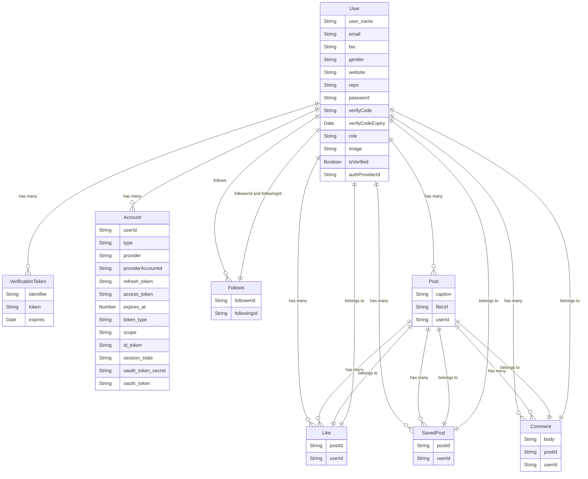

```mermaid
erDiagram
    User {
        String user_name
        String email
        String bio
        String gender
        String website
        String repo
        String password
        String verifyCode
        Date verifyCodeExpiry
        String role
        String image
        Boolean isVerified
        String authProviderId
    }
    VerificationToken {
        String identifier
        String token
        Date expires
    }
    Account {
        String userId
        String type
        String provider
        String providerAccountId
        String refresh_token
        String access_token
        Number expires_at
        String token_type
        String scope
        String id_token
        String session_state
        String oauth_token_secret
        String oauth_token
    }
    Follows {
        String followerId
        String followingId
    }
    Post {
        String caption
        String fileUrl
        String userId
    }
    SavedPost {
        String postId
        String userId
    }
    Like {
        String postId
        String userId
    }
    Comment {
        String body
        String postId
        String userId
    }

    %% Relationships
    User ||--o{ Post : "has many"
    User ||--o{ SavedPost : "has many"
    User ||--o{ Like : "has many"
    User ||--o{ Comment : "has many"
    User ||--o{ Follows : "follows"
    User ||--o{ Account : "has many"
    User ||--o{ VerificationToken : "has many"
    Post ||--o{ Like : "has many"
    Post ||--o{ SavedPost : "has many"
    Post ||--o{ Comment : "has many"
    Follows ||--|| User : "followerId and followingId"
    SavedPost ||--|| Post : "belongs to"
    SavedPost ||--|| User : "belongs to"
    Like ||--|| Post : "belongs to"
    Like ||--|| User : "belongs to"
    Comment ||--|| Post : "belongs to"
    Comment ||--|| User : "belongs to"
```