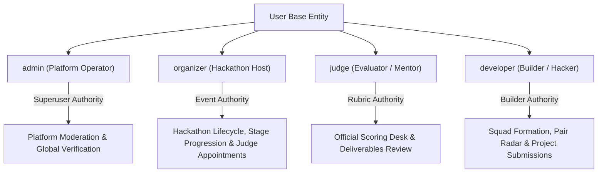
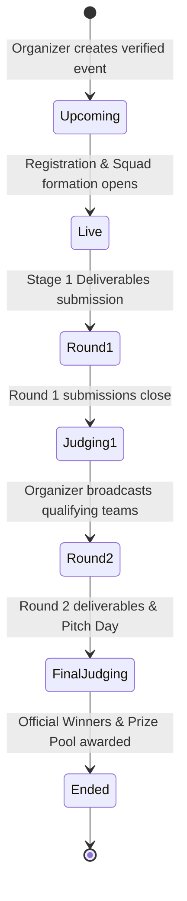
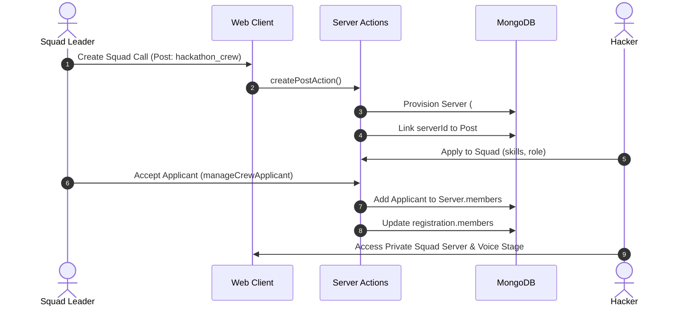
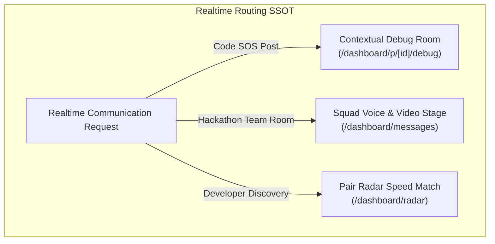

# Nerd'sHive Core Business Logic & Single Source of Truth (SSOT)

> **MANDATORY DIRECTIVE FOR ALL DEVELOPERS & AI AGENTS**  
> This document is the **authoritative Single Source of Truth (SSOT)** for all business logic, authorization invariants, data relations, and lifecycle state machines across Nerd'sHive.  
> **No code change, refactoring, or feature addition may violate the core invariants defined in this document.**

---

## 1. Architectural Principles & Invariant Commandments

The following **8 Non-Negotiable Invariants** govern all platform code:

1. **Backend-Enforced Authorization (Zero Client-Only Trust)**:  
   UI conditional rendering (`{isAdmin && ...}`) is purely for UX cleanliness. Every backend mutation (Server Action, API Route, WebSocket message) **must independently assert authorization** via [rbac.ts](file:///Users/biplabmal/Documents/projects/nerdshive/web/lib/rbac.ts). Bypasses must return `403 Forbidden` or `{ failure: '403 Forbidden: ...' }`.
2. **Deterministic & Contextual Realtime Communication**:  
   Realtime video/audio must never dump users into generic, unstructured roulette queues. Every session must be **context-aware** (Code SOS debug room bound to `postId`, Squad War Room bound to `registrationId`/`serverId`, Pair Radar bound to validated technical intents).
3. **Immutability of Evaluation & Rubric Scores**:  
   Once a hackathon evaluation is submitted by an appointed judge or organizer, it cannot be modified or deleted by competitor teams. Average scores and elimination thresholds must be computed strictly from persisted [HackathonEvaluation](file:///Users/biplabmal/Documents/projects/nerdshive/web/models/entities/hackathon-evaluation.entity.ts) records.
4. **Anti-Clone Shield & Namespace Uniqueness**:  
   Hackathon slugs, Server invite codes, and User handles are unique and immutable once created. Duplicate slug forgery is strictly rejected at the database index layer and server action pre-validation.
5. **Private Squad Server Isolation**:  
   Squad Discord Servers auto-provisioned during hackathon formation are strictly private. Only confirmed members accepted by the squad leader can access the channels and voice/video stages.
6. **Distributed State via Shared Storage**:  
   No multi-pod signaling state (matchmaking queues, direct room pairs, active call mappings) may reside exclusively in a single Node.js process heap. Redis is the distributed state broker; in-memory maps are fallbacks for local standalone mode only.
7. **Karma & Bounty Economic Integrity**:  
   Karma awards (e.g. `+50 Karma` for Code SOS resolution) can only be granted upon verified resolution of an active request by the post's authenticated author.
8. **Preservation of Documentation & Non-Destructive Extension**:  
   Never delete or overwrite existing docstrings, interfaces, or database entity fields when adding new features. Extend via additive schema modifications.
9. **Zero-Loss Soft Deletion & Statutory 180-Day Retention**:  
   No user account, hackathon event, squad submission, or developer post may ever be immediately hard-deleted. All deletions transition records into a soft-deleted state (`isDeleted: true`, `retentionExpiresAt = now + 180 days`) with instant 1-click recovery capability. Under **Rule 3(1)(h) of the IT Rules 2021** and **CERT-In Directions**, data is preserved in Mumbai (`ap-south-1`) for 180 days before DPDP Act compliant scrubbing. Refer to [DATA_STORAGE_AND_BACKUP_POLICY.md](./DATA_STORAGE_AND_BACKUP_POLICY.md).

---

## 2. Domain 1: Identity, RBAC & Persona Hierarchy

### 2.1 The 4 Core Personas



| Persona | DB Role | Target User Journey | Permitted Mutations | Irrelevant / Omitted Features |
| :--- | :--- | :--- | :--- | :--- |
| **Platform Operator** | `admin` | Platform oversight, anti-fraud, verification governance | Global event moderation, role promotion, system overrides | Competitor-only workflows |
| **Hackathon Host** | `organizer` | Launching events, multi-round stage progression, judge selection | Create hackathons, review applications, advance teams, broadcast results, appoint judges | Competitor squad application buttons |
| **Evaluator / Mentor** | `judge` | Impartial rubric scoring, deliverable inspection, mentorship | Access Official Judging Desk, score submissions (0–10), submit qualitative notes | Applications Kanban, Stage Promotion, Event Settings |
| **Builder / Hacker** | `developer` | Building projects, squad recruitment, live pair-coding | Create posts, assemble squads, join voice rooms, submit project deliverables | "+ Host Hackathon", "Organizer Command Center", "Judging Desk" |

### 2.2 Central RBAC Engine: [rbac.ts](file:///Users/biplabmal/Documents/projects/nerdshive/web/lib/rbac.ts)

All backend gates **must** invoke these canonical functions:

- `canCreateHackathon(user)`: Returns `true` if `user.role === 'admin' || user.role === 'organizer'`.
- `canManageHackathon(user, event)`: Returns `true` if `user.role === 'admin'` OR (`user.role === 'organizer' && event.organizerId === user._id`).
- `canJudgeHackathon(user, event)`: Returns `true` if `user.role === 'admin'`, or `event.organizerId === user._id`, or `event.judges.includes(user._id)`.
- `canSubmitProject(user, registration)`: Returns `true` if `registration.status === 'accepted'` AND (`registration.leaderId === user._id || registration.members.some(m => m.user === user._id)`).
- `canManageSquad(user, registration)`: Returns `true` if `registration.leaderId === user._id`.
- `canModeratePlatform(user)`: Returns `true` if `user.role === 'admin'`.

### 2.3 Session & Token Synchronization
- **Single Source of Truth**: Database record in `User` collection.
- **Rule**: In [auth.ts](file:///Users/biplabmal/Documents/projects/nerdshive/web/auth.ts), the `jwt` callback queries the database user by ID on every token issuance/refresh (`token.role = dbUser.role`) so role promotions/demotions take effect immediately without requiring user re-login.

---

## 3. Domain 2: Hackathon Ecosystem & Multi-Round Advancement

### 3.1 Event Lifecycle State Machine



1. **Anti-Clone Shield**:
   - Every hackathon must have a unique URL slug (`slug: String, unique: true, index: true`).
   - Counterfeit attempts using duplicate slugs are rejected with an explicit error.
   - `isVerified: true` is granted exclusively by Platform Admins or verified organizer institutions.
2. **Multi-Round Stage Progression**:
   - Hackathons define an array of stages in `HackathonEvent.rounds`:
     `[{ roundNumber: 1, name: 'Idea & Prototype', submissionDeadline: Date }, { roundNumber: 2, name: 'Final Demo & Pitch', ... }]`.
   - `publishRoundResultsAction(slug, roundNumber, advancingTeamIds)`:
     - Enforces `canManageHackathon`.
     - Advances all selected teams to `currentRound = roundNumber + 1`.
     - Non-advancing teams remain in the system for historical record but are locked from submitting subsequent stage deliverables.
3. **Official Rubric Judging**:
   - Stored in [HackathonEvaluation](file:///Users/biplabmal/Documents/projects/nerdshive/web/models/entities/hackathon-evaluation.entity.ts).
   - Multi-criteria breakdown:
     - `criteriaScores: [{ name: String, score: Number, maxScore: Number, comment: String }]`
     - Computed `totalScore = sum(criteriaScores.map(c => c.score))`.
   - Team average score is dynamically aggregated from all judge evaluations for that specific round:
     $$\text{Average Score} = \frac{\sum_{i=1}^{N} \text{Evaluation}_i.\text{totalScore}}{N}$$
4. **Judge Roster Management**:
   - Stored on `HackathonEvent.judges: [{ type: Schema.Types.ObjectId, ref: 'User' }]`.
   - Organizers can appoint judges by username or email via `manageHackathonJudgesAction`. Appointed users automatically receive `role: 'judge'`.

---

## 4. Domain 3: Squad Formation & Private Server Provisioning



1. **Automatic Server Provisioning**:
   - When a `hackathon_crew` post is created, the system auto-provisions a private `Server` entity with:
     - Text channels: `#general`, `#resources`.
     - Voice channel: `voice:pair-hacking` (`type: 'voice'`).
     - Members: Leader initialized as `role: 'owner'`.
2. **Applicant Acceptance & Auto-Enrollment**:
   - Only the squad leader can accept applicants.
   - Upon acceptance via `manageCrewApplicant`:
     - Applicant is appended to `post.hackathonCrew.applicants` with status `'accepted'`.
     - Applicant is auto-enrolled into `Server.members` (`role: 'member'`).
     - Applicant is auto-enrolled into `HackathonRegistration.members`.
3. **Project Deliverables Submission Gate**:
   - `submitRoundProjectAction(slug, registrationId, roundNumber, formData)`:
     - Strictly checks `canSubmitProject(session.user, registration)`.
     - Requires registration status to be `'accepted'`.
     - Only confirmed squad members can upload/edit repo URL, demo URL, and pitch video.

---

## 5. Domain 4: Contextual Realtime Video/Audio Engine

The platform operates **3 segregated, context-aware realtime communication experiences**:



### 5.1 Contextual Code SOS Debug Room (`/dashboard/p/[id]/debug`)
- **Deterministic Room ID**: `sos_${postId}`.
- **Participants**: Post Author + Helper Engineer.
- **In-Room State & Lifecycle**:
  - Pre-loads `post.codeSos.snippet` in shared editor.
  - WebRTC `DataConnection` synchronizes code edits in real-time.
  - Stack trace inspector displays `post.codeSos.errorLog`.
  - Author can trigger in-room `[Mark Bug Resolved]`:
    - Calls `resolveCodeSosPost({ postId, solutionSummary })`.
    - Updates post in DB with `isResolved: true`.
    - Credits `+50 Bounty Karma` to the helper.
    - Locks subsequent modification of the post.

### 5.2 Private Squad War Room (`voice:pair-hacking`)
- **Channel**: Provisioned voice channel inside squad server.
- **Access**: Strictly restricted to confirmed `Server.members`.
- **Media Plane**: Multi-peer WebRTC mesh with active speaking detection and screen sharing.

### 5.3 Pair Radar Speed Networking (`/dashboard/radar`)
- **Route**: Dedicated `/dashboard/radar` (with backward compatibility redirect from `/dashboard/stranger-chat`).
- **Targeted Intents**:
  - `project_teammate`: Hackathon Teammate Scout.
  - `pair_debug`: Open Source & Pair Hacker.
- **Profile Exchange**: DataChannel automatically exchanges verified Nerd'sHive profiles (Username, Name, Skills, Bio, GitHub link).
- **Control Bar**: Audio, Video, Screen Share, and Next Developer Skip.

### 5.4 Distributed Scaling & State Brokerage (Redis Invariant)
To guarantee zero disconnects and seamless horizontal scaling:
- **`match_queue:<intent>`**: Atomic Redis lists (`rpop`/`lpush`) for cross-pod matchmaking.
- **`direct_room:<roomId>`**: Redis string key with 1-hour TTL storing active direct room hosts across pods.
- **`active_match:<socketId>`**: Redis key tracking partner mappings, ensuring that disconnections on Pod A dispatch `'left'` notifications to Pod B without ghost sessions.

---

## 6. Domain 5: Feed, Posts & Cockpit Architecture

### 6.1 Supported Post Types & Schemas

| Post Type (`postType`) | Primary Purpose | Key Schema Fields |
| :--- | :--- | :--- |
| `project` | Showcase shipped projects | `project.title`, `project.description`, `project.techStack`, `project.liveUrl`, `project.githubUrl` |
| `code_sos` | Urgent debugging request | `codeSos.title`, `codeSos.snippet`, `codeSos.errorLog`, `codeSos.triedSteps`, `codeSos.language`, `codeSos.bountyKarma`, `codeSos.isResolved` |
| `hackathon_crew` | Squad recruitment call | `hackathonCrew.hackathonId`, `hackathonCrew.hackathonName`, `hackathonCrew.rolesNeed`, `hackathonCrew.serverId`, `hackathonCrew.applicants` |
| `ship_log` | Dev product updates | `shipLog.title`, `shipLog.pitch`, `shipLog.milestone`, `shipLog.techStack` |
| `architecture_rfc` | System design debate | `architectureRfc.title`, `architectureRfc.challenge`, `architectureRfc.proposedSolution` |
| `tech_showdown` | A vs B technology voting | `techShowdown.topic`, `techShowdown.optionA`, `techShowdown.optionB` |

### 6.2 The Stationary Cockpit Rail
- **Layout Invariant**: The main feed container uses `items-start`, and the right cockpit rail uses `sticky top-1 self-start h-[calc(100vh-2.5rem)]`.
- **Feed scrolls independently** while the cockpit remains stationary.
- **Modes**:
  - **⚡ Pulse**: Live Pair Radar shortcut, Target Hackathons countdown, quick post launchers.
  - **💬 Discord & Squad Chat**: Embedded real-time text chat with channel switching.
  - **💭 Active Discussion**: Contextual comments focused on the active post selected in the feed via `focusPostDiscussion(post)`.

---

## 7. The Extension Protocol: Where & How to Add New Features

Follow this exact blueprint when extending the platform to preserve core integrity:

### Pattern A: Adding a New Post Type
1. **Model**: Update [post.entity.ts](file:///Users/biplabmal/Documents/projects/nerdshive/web/models/entities/post.entity.ts) to add subdocument schema and extend `IPost` interface and `postType` enum.
2. **Creation Form**: Add tab and form fields in [create-post-form.tsx](file:///Users/biplabmal/Documents/projects/nerdshive/web/app/dashboard/create/create-post-form.tsx).
3. **Server Action**: Handle payload validation in `createPost` within [actions.ts](file:///Users/biplabmal/Documents/projects/nerdshive/web/lib/actions.ts).
4. **Feed Component**: Create a dedicated `web/components/dev-posts/<Feature>UI.tsx` and register in [Post.tsx](file:///Users/biplabmal/Documents/projects/nerdshive/web/components/Post.tsx).

### Pattern B: Adding a New Realtime Communication Mode
1. **Rule**: **NEVER** dump new realtime features into a generic stranger-chat queue.
2. **Routing**: Create a dedicated page under the appropriate entity domain (e.g. `/dashboard/hackathons/[slug]/pitch-room` or `/dashboard/interviews/[id]`).
3. **Signaling Room**: Use deterministic room naming: `<feature>_<entityId>` (e.g. `pitch_<registrationId>`).
4. **Gateway**: Connect via `direct_room:join` using [webrtc-utils.ts](file:///Users/biplabmal/Documents/projects/nerdshive/web/lib/webrtc-utils.ts).
5. **Authorization**: Add an explicit permission check in [rbac.ts](file:///Users/biplabmal/Documents/projects/nerdshive/web/lib/rbac.ts).

### Pattern C: Adding a New RBAC Permission
1. **Engine**: Add a pure function `can<Action>(user, context)` in [rbac.ts](file:///Users/biplabmal/Documents/projects/nerdshive/web/lib/rbac.ts).
2. **Server Action**: Assert the permission at the very top of the server action:
   ```typescript
   if (!can<Action>(session.user, context)) {
     return { failure: '403 Forbidden: Access Restricted.' };
   }
   ```
3. **Route Guard**: In Server Components (`page.tsx`), assert permission and render a 403 screen or redirect unauthorized visitors.
4. **UI**: Conditionally hide buttons and navigation links for non-eligible roles.
5. **Security Test**: Add a test case in [rbac-bypass-proof-test.js](file:///Users/biplabmal/Documents/projects/nerdshive/tests/security/rbac-bypass-proof-test.js).

---

## 8. Prohibited Anti-Patterns (NEVER DO THESE)

| Prohibited Anti-Pattern | Why It is Forbidden | Proper Architecture Alternative |
| :--- | :--- | :--- |
| **Client-Only Security** | Easily bypassed via `curl` or browser devtools | Always enforce via `rbac.ts` on server actions & API routes |
| **Random Stranger Chat Queues for Structured Tasks** | Destroys UX; users fail to pair with actual collaborators | Use contextual deterministic rooms (`sos_<id>`, `squad_<id>`) |
| **Hardcoding In-Memory Maps for Multi-Pod State** | Fails in clustered environments (Render, Kubernetes, Docker Swarm) | Use Redis with TTLs (`direct_room:*`, `active_match:*`) |
| **Deleting or Overwriting Unrelated Code/Docstrings** | Destroys context and causes subtle regressions | Additive modifications; preserve non-conflicting logic |
| **Bypassing the Anti-Clone Shield** | Allows duplicate hackathon impersonation & user confusion | Always enforce unique index on `HackathonEvent.slug` |
| **Immediate Hard Deletion (`deleteOne` on Core Records)** | Causes catastrophic irrecoverable data loss on accidental click or error | Always use soft-delete via `retention.ts` with 180-day statutory retention |
