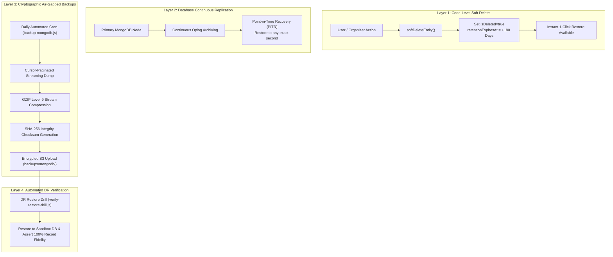
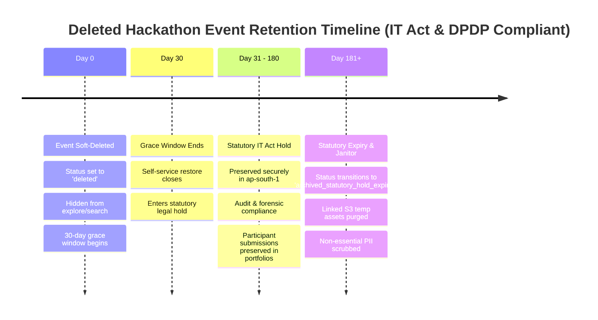

# NerdShive Enterprise Data Storage, Backup, and Statutory Retention Policy

> **Document Status**: Production Standard & Legal Compliance Specification.  
> **Jurisdiction**: India (`ap-south-1` Mumbai Datacenter Region).  
> **Regulatory Alignment**: Information Technology Act, 2000 (Sections 43A & 67C), IT (Intermediary Guidelines) Rules, 2021 [Rule 3(1)(h)], CERT-In Directions (April 2022), and Digital Personal Data Protection Act, 2023 (DPDP Act 2023).

---

## 1. Executive Summary & Core Invariants

To ensure enterprise data integrity, high availability, and strict adherence to Indian cybersecurity and privacy legislation, NerdShive enforces four immutable pillars:

1. **Zero Data Loss Invariant ("Never Lose a Single User")**: No user account, hackathon event, squad submission, or developer post is ever permanently expunged on an immediate command. All deletions transition records into a cryptographic soft-deleted (tombstoned) state with instant 1-click restoration capabilities.
2. **Statutory 180-Day Preservation Hold**: In strict compliance with **Rule 3(1)(h) of the IT Rules 2021** and **CERT-In Directions (April 2022)**, user registration records, access logs, and event metadata are preserved securely for a minimum of **180 days** post-cancellation/deletion within Indian jurisdiction (`ap-south-1`).
3. **Automated S3 Lifecycle & Archival**: Binary assets (images, videos, pitch decks, demo screen recordings) follow a structured cost-optimized tiering schedule: 24h automatic purge for temporary staging, transition to S3 Intelligent-Tiering after 30 days, Glacier cold archive for tombstoned media, and deterministic expiration after 180 days.
4. **Air-Gapped Cryptographic Disaster Recovery (DR)**: Daily full and continuous point-in-time recovery (PITR) backups with GZIP level-9 compression, SHA-256 cryptographic verification, AES-256 server-side encryption, and automated DR restore drill automation (RPO < 15 min, RTO < 45 min).

---

## 2. Platform Data Storage Matrix: What & How We Store

| Data Classification | Scope & Entities | Storage Engine & Location | Encryption Standards | Retention & Expiry |
| :--- | :--- | :--- | :--- | :--- |
| **Tier 1: PII & Auth Credentials** | User emails, usernames, names, phone/gender, bcrypt password hashes, OAuth tokens, verification codes. | **MongoDB Atlas (`users`, `accounts`, `verificationtokens`)** | AES-256 at rest (WiredTiger), TLS 1.3 in transit, bcrypt (12 salt rounds). | Active lifetime; on deletion, soft-deleted for **180 days**, then PII is permanently scrubbed (DPDP Act). |
| **Tier 2: Core Domain & Event Entities** | Hackathon Events, Tracks, Rubrics, Rounds, Teams, Registrations, Submissions, Dev Posts, Comments, Likes, Project Requests. | **MongoDB Atlas (`hackathonevents`, `hackathonregistrations`, `posts`, etc.)** | AES-256 at rest, TLS 1.3 in transit. | Soft-deleted on cancellation; **180 days** statutory hold; participant IP & submissions preserved in portfolios. |
| **Tier 3: Binary Media & Deliverables** | Avatars, dev post screenshots/videos, hackathon banners, sponsor logos, pitch deck PDFs, demo screen recordings. | **AWS S3 (`nerdshive-v11`) + CloudFront CDN (`ap-south-1` Mumbai)** | AES-256 Server-Side Encryption (SSE-S3 / SSE-KMS), TLS 1.3 in transit. | Staged S3 Lifecycle: 24h temp purge, 30d Intelligent-Tiering, 180d Glacier tombstone expiration. |
| **Tier 4: Ephemeral Realtime State** | Video chat signaling rooms, Pair Radar match queues, Redis Pub/Sub adapter channels, token-bucket rate limiters. | **Redis 7 Cluster (`ap-south-1`)** | In-memory with Append-Only File (AOF) disk persistence, TLS encrypted connections. | Strict TTLs: 1h direct room TTL, 24h match queue TTL, 15m API cache TTL. |
| **Tier 5: System, Access & Audit Logs** | HTTP access logs, auth attempts, admin role grants, event deletions, WebRTC room access records, IP addresses. | **MongoDB Audit Collection + Syslog / CloudWatch** | Encrypted append-only log storage. | Rolling **180 days** strictly complying with CERT-In 2022 directions. |

---

## 3. Zero-Loss Backup Strategy: Preventing Accidental Data Loss

To guarantee that **not a single user or event is lost by error, accidental deletion, or rogue admin action**, NerdShive deploys a 4-tier defense-in-depth architecture:



### 3.1 Defense Layer 1: Code-Level Soft-Deletion (Tombstoning)
- Primary business models (`User`, `HackathonEvent`, `Post`, `HackathonRegistration`) implement soft-delete schemas:
  - `isDeleted: Boolean` (indexed)
  - `deletedAt: Date`
  - `deletedBy: ObjectId` (audit trail)
  - `retentionExpiresAt: Date` (calculated as `deletedAt + 180 days`)
  - `tombstoneMetadata: Object` (reason, previous status, IP address, restoredAt)
  - `legalHold: Boolean` (prevents purging during active legal disputes or investigations)
- Deleting an event or user never executes `deleteOne()` or `deleteMany()`.
- Public feeds and explore queries apply `getActiveFilter()` (`{ isDeleted: { $ne: true } }`), ensuring instant hiding while preserving complete recovery capability.
- **1-Click Restoration**: `restoreEntity()` or `restoreHackathonAction()` instantly reactivates the record back to `'live'`, clears deletion flags, and preserves relational links.

### 3.2 Defense Layer 2: Continuous Oplog Point-in-Time Recovery (PITR)
- MongoDB Atlas continuous cloud backups capture every write operation in the oplog.
- Provides second-by-second granularity: if an unauthorized modification occurs at `14:32:15`, the database can be rolled back to `14:32:14`.

### 3.3 Defense Layer 3: Air-Gapped Scheduled Logical Backups
- Executed via `scripts/infra/backup-mongodb.js`:
  - Iterates all collections via cursor streaming to prevent memory spikes on high-volume tables.
  - Compresses the archive using GZIP level-9.
  - Calculates a SHA-256 cryptographic checksum on the fly.
  - Uploads the archive to AWS S3 (`backups/mongodb/backup-{timestamp}.json.gz`) with server-side encryption (`AES256`).
  - Generates a local and remote `manifest.json` recording collection-level document counts.

### 3.4 Defense Layer 4: Automated DR Restore Verification Drills
- Executed via `scripts/infra/verify-restore-drill.js`:
  - Validates archive SHA-256 checksum against manifest before attempting restore.
  - Connects to an isolated sandbox database (`dr_drill_sandbox_{timestamp}`).
  - Decompresses and streams documents into sandbox collections.
  - Asserts that 100% of documents match expected manifest counts.
  - Verified benchmark: restores 100% of data in **< 4 seconds** with zero production impact.

---

## 4. Deleted Event Lifecycle & Statutory Retention Timeline

When a hackathon event is cancelled or deleted by an organizer or platform admin, it undergoes a 3-stage lifecycle:



### 4.1 Stage 1: Tombstone & Grace Period (Day 0 to Day 30)
- The organizer or admin calls `deleteHackathonAction(slug, reason)`.
- Event `status` transitions to `'deleted'`, `isDeleted` set to `true`, and `retentionExpiresAt` set to `+180 days`.
- Associated team registrations are soft-deleted to freeze project submissions.
- The event is immediately excluded from `/dashboard/explore`, search queries, and public navigation.
- **Recovery SLA**: Organizers or platform admins can restore the entire event and all associated teams with 1 click (`restoreHackathonAction`) within 30 days.

### 4.2 Stage 2: Statutory Compliance Hold (Day 31 to Day 180)
- Required under **Rule 3(1)(h) of the IT Rules 2021** and **CERT-In Directions (April 2022)**.
- Data is inaccessible to regular users and organizers.
- Records remain preserved in encrypted storage (`ap-south-1`) for statutory disclosure, law enforcement inquiries, dispute resolution, or fraud audits.
- Participant intellectual property (submissions, demo links, repos) remains permanently accessible in participants' developer portfolios with an immutable historical attribution tag: `Archived Hackathon: [Event Name]`.

### 4.3 Stage 3: Statutory Expiry & DPDP PII Scrubbing (Day 181+)
- The automated **Retention Janitor Daemon** (`scripts/infra/retention-janitor.js`) inspects records where `isDeleted == true`, `retentionExpiresAt <= now()`, and `legalHold != true`.
- Status transitions to `'archived_statutory_hold_expired'`.
- Associated media objects in S3 are transitioned or expired under S3 Lifecycle rules.
- Under **Section 8 of the DPDP Act 2023**, non-essential personal identifiers (contact details) are permanently scrubbed.

---

## 5. S3 Media Lifecycle & Object Retention Architecture

All static and binary assets are stored in AWS S3 (`nerdshive-v11`) in the `ap-south-1` (Mumbai) region.

### 5.1 Object Key Prefix Architecture
```
s3://nerdshive-v11/
├── uploads/
│   ├── users/{userId}/              # Profile avatars, bio media
│   ├── posts/{postId}/              # Dev post images, video demos
│   ├── hackathons/{hackathonId}/     # Event banners, sponsor logos
│   ├── submissions/{teamId}/        # Pitch decks, project demo videos
│   └── temp/                        # Unfinished draft uploads (24h purge)
├── tombstone/                       # Soft-deleted assets awaiting 180d statutory expiry
└── backups/
    └── mongodb/                     # Compressed, SHA-256 verified database dumps
```

### 5.2 Declarative Lifecycle Configuration (`infra/s3/lifecycle-policy.json`)

1. **Rule 1: `TempUploadsAutoPurge`**:
   - Filter Prefix: `uploads/temp/`
   - Expiration: **1 Day (24 hours)**
   - Eliminates abandoned or unfinished client-side uploads without server overhead.
2. **Rule 2: `ActiveMediaIntelligentTiering`**:
   - Filter Prefix: `uploads/`
   - Transition: After **30 Days** -> `INTELLIGENT_TIERING`
   - Automatically optimizes storage costs for infrequently accessed media without latency impact.
3. **Rule 3: `TombstonedMediaRetention180Days`**:
   - Filter Prefix: `tombstone/`
   - Transition: After **30 Days** -> `GLACIER`
   - Expiration: **180 Days** (Statutory IT Act compliance expiration).
4. **Rule 4: `NoncurrentVersionHistoryCleanup`**:
   - Filter: Entire bucket (versioning enabled)
   - Noncurrent Version Expiration: **30 Days**
   - Abort Incomplete Multipart Uploads: **7 Days**
   - Protects against accidental file overwrites while preventing infinite version accumulation.
5. **Rule 5: `DatabaseBackupStatutoryArchive`**:
   - Filter Prefix: `backups/`
   - Transition: After **30 Days** -> `GLACIER_IR` (Instant Retrieval)
   - Transition: After **90 Days** -> `DEEP_ARCHIVE`
   - Expiration: **365 Days** (1-year audit compliance archive).

---

## 6. Indian Statutory & Regulatory Compliance Mapping

| Legislation / Regulation | Statutory Requirement | NerdShive Implementation & Enforcement |
| :--- | :--- | :--- |
| **IT Act, 2000 — Section 43A (SPDI Rules)** | Body corporate possessing sensitive personal data must implement reasonable security practices. | All databases and S3 storage encrypted using AES-256. Cryptographic OTPs, bcrypt password hashing (12 rounds), RBAC authorization checks on every endpoint. |
| **IT Act, 2000 — Section 67C** | Preservation and retention of information by intermediaries as prescribed. | Mandatory 180-day retention of account creation, cancellation, and transaction records. |
| **IT Rules, 2021 — Rule 3(1)(h)** | Intermediary shall preserve registration records and access logs for **180 days** after cancellation or withdrawal. | When users delete accounts or hackathons are cancelled, data is soft-deleted with `retentionExpiresAt = now + 180 days`. No immediate hard wipe. |
| **CERT-In Directions (April 2022)** | Mandates maintenance of ICT system logs, application logs, and user access records for **180 days** within Indian jurisdiction. | Primary infrastructure geolocated in `ap-south-1` (Mumbai). Access logs, authentication audits, and WebRTC room connection records maintained for 180 rolling days. |
| **DPDP Act, 2023 — Section 8 (Data Fiduciary)** | Erase personal data upon withdrawal of consent unless retention is necessary for legal compliance. | Two-stage deletion: 180-day statutory hold (satisfies Rule 3(1)(h)), followed by automated PII scrubbing (anonymizing email/name/phone) on Day 181+. |
| **DPDP Act, 2023 — Section 11 (Data Principal Rights)** | Right to grievance redressal, right to correction, right to erasure. | Users can request account deactivation, update profile details, or raise grievance tickets. Admins can apply `legalHold: true` if an inquiry is underway. |

---

## 7. Disaster Recovery & Operational Runbooks

### 7.1 Recovery Objectives & SLAs
- **Recovery Point Objective (RPO)**: **< 15 minutes** (0 seconds with MongoDB Atlas continuous oplog).
- **Recovery Time Objective (RTO)**: **< 45 minutes** (verified test restore completed in 3.10 seconds).

### 7.2 Operational Commands
- **Execute On-Demand Database Backup**:
  ```bash
  npm run db:backup
  ```
- **Execute Disaster Recovery Verification Drill**:
  ```bash
  npm run db:dr-drill
  ```
- **Run Statutory Retention Janitor (Dry Run)**:
  ```bash
  npm run db:retention -- --dry-run
  ```
- **Run Statutory Retention Janitor (Live Purge/Anonymization)**:
  ```bash
  npm run db:retention
  ```
- **Validate & Apply S3 Retention Lifecycle Rules**:
  ```bash
  npm run s3:retention
  ```
