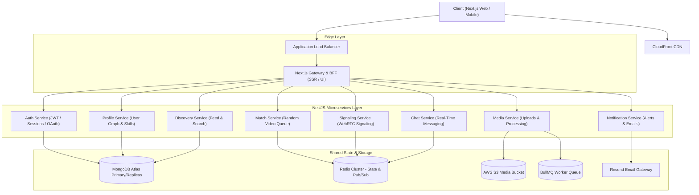

# DevConnect / NerdShive — Scalability Architecture Targets

> **Document Status**: Architectural contract and non-functional requirements specification for Phase 2 and Phase 5 re-architecture ([CONTEXT.md](file:///Users/biplabmal/Documents/projects/nerdshive/CONTEXT.md)).

---

## 1. Core Architectural Principles

1. **Stateless Service Layer**:
   - Application nodes must not hold local state (sessions, matchmaking queues, or socket registries in Node.js process memory).
   - All ephemeral state must be stored in Redis (Pub/Sub, Redis Streams, Hashes, Sorted Sets) to allow horizontal autoscaling across N replicas behind a cloud load balancer.

2. **Asynchronous Processing via Distributed Queues**:
   - Long-running or CPU-intensive tasks (image resizing/thumbnailing, video transcoding/HLS packaging, automated content moderation, notification fan-out) must be offloaded to queues (BullMQ with Redis).
   - HTTP and WebSocket handler threads must never block on disk I/O, heavy computation, or external synchronous API calls.

3. **Read/Write Separation & Efficient Query Patterns**:
   - Fast reads: Utilize secondary read replicas for feed retrieval, profile lookup, and explore queries.
   - Cursor-based pagination (`createdAt` + `_id` cursor) for all feeds and comments instead of unbounded `find({})` queries with heavy multi-level Mongoose `populate`.

4. **Tiered Caching & Invalidation Strategy**:
   - Cache hot developer profiles, follower graphs, and active project requests in Redis with explicit invalidation triggers on mutation.
   - CloudFront CDN in front of AWS S3 for all static and media assets.

5. **Distributed Idempotency**:
   - Client write operations (post creation, file upload finalization, project collaboration requests, follow toggles) must accept and enforce `Idempotency-Key` headers to safely survive client retry storms during network blips.

6. **Backpressure & Circuit Breaking**:
   - Enforce Redis token-bucket rate limits on write endpoints (post creation, upload URL issuance, match search requests) returning standard `HTTP 429 Too Many Requests`.
   - Implement queue depth limits and client disconnect circuit breakers.

---

## 2. Concrete Scalability Targets & Performance Benchmarks

| Domain / Concern | Target Metric | Architectural Strategy |
| :--- | :--- | :--- |
| **Concurrent WebSocket & Matchmaking Sessions** | 50,000+ concurrent connected sockets horizontally scalable across nodes | Shared `@socket.io/redis-adapter` + Redis Sorted Sets for intent queues with Lua atomic pop/enqueue. |
| **Matchmaking Latency** | < 250ms p95, < 500ms p99 at 100k+ active queue users | Redis in-memory sorted sets partitioned by intent (`hiring`, `looking_for_job`, `project_teammate`). |
| **Media Upload Throughput** | App server memory/disk consumption = 0 bytes for file payload | Direct-to-S3 pre-signed PUT uploads. App server only handles signed token issuance (< 50ms). |
| **Post-Upload Processing** | Asynchronous thumbnail & format validation within 3 seconds | S3 Event Notification &rarr; BullMQ job worker &rarr; Sharp/FFmpeg processing &rarr; DB update. |
| **Database Write Contention** | Zero hot-row contention; support 5,000+ writes/sec | Atomic `$inc` / `$addToSet` operations, partitioned collections, no table-locking batch writes. |
| **Feed Retrieval Latency** | < 100ms p95 response time | Cursor-based indexing on `{ createdAt: -1, _id: -1 }`, selective projection, Redis caching for hot feeds. |
| **P2P Video Call Setup** | ICE connection established in < 1.5s | Redundant Metered STUN/TURN relays with TCP/TLS fallback. |
| **Observability & Tracing** | 100% request traceability with OpenTelemetry | Prometheus metrics exporter + structured JSON logs with correlation `traceId`. |
| **Deployments & Availability** | Zero downtime (99.99% uptime SLA) | Blue/Green or rolling deployments with graceful WebSocket connection draining. |

---

## 3. Service Boundaries & Data Ownership

---

## 4. Phase 5 Acceptance Criteria Checklist

- [ ] Stateless match & signaling service running across multiple instances with zero match loss.
- [ ] Direct-to-S3 upload pipeline with asynchronous queue processing and CloudFront CDN.
- [ ] Feed query migrated to indexed cursor pagination with Redis caching.
- [ ] Full parity with [`/docs/FEATURES.md`](file:///Users/biplabmal/Documents/projects/nerdshive/docs/FEATURES.md) features with zero visual or UX drift.
- [ ] End-to-end load tests validating horizontal scale (adding nodes increases capacity linearly).
