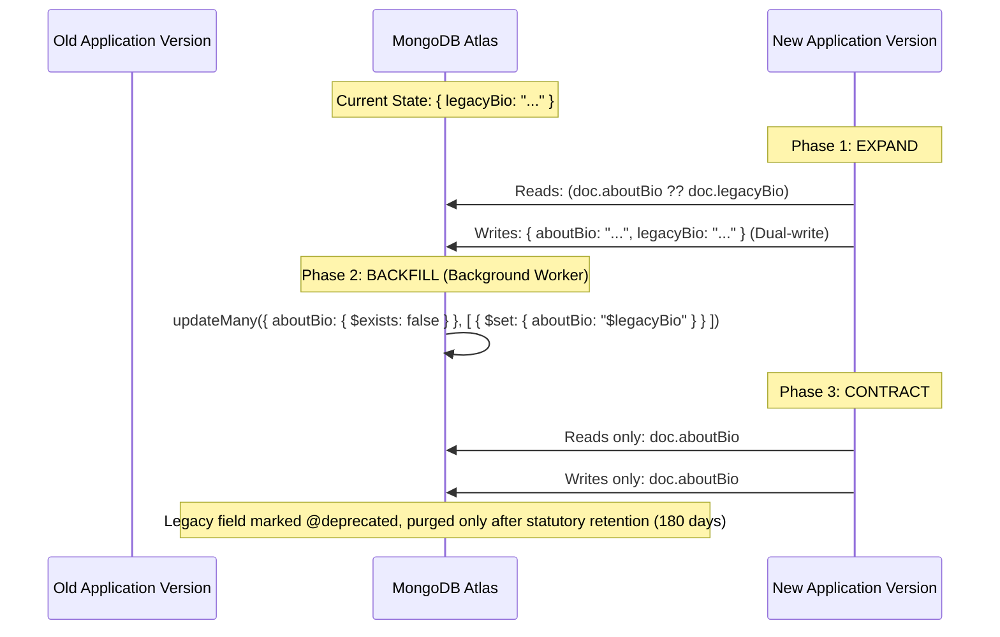

# Entity Evolution, Backward Compatibility & Collision Prevention Standard

> **Document Status**: Production Architectural Standard & Non-Negotiable Engineering Rulebook.  
> **Target Audience**: All Backend Engineers, Core Contributors, and Autonomous AI Agents.

---

## 1. Core Philosophy: The Zero-Regression Guarantee

In a mission-critical developer platform serving active hackathons, code debugging sessions, and persistent developer portfolios, **data corruption, broken historical queries, and concurrent write collisions are completely unacceptable**.

Every modification to any domain entity ([User](file:///Users/biplabmal/Documents/projects/nerdshive/web/models/entities/user.entity.ts), [HackathonEvent](file:///Users/biplabmal/Documents/projects/nerdshive/web/models/entities/hackathon.entity.ts), [Post](file:///Users/biplabmal/Documents/projects/nerdshive/web/models/entities/post.entity.ts), [HackathonRegistration](file:///Users/biplabmal/Documents/projects/nerdshive/web/models/entities/hackathon-registration.entity.ts), etc.) must strictly maintain **100% backward compatibility** with past database documents and zero-downtime client versions.

---

## 2. The 7 Golden Rules of Backward-Compatible Entity Evolution

### Rule 1: The Additive-Only Law (Never Drop, Never Rename In-Place)
- **New Fields Must Be Non-Breaking**: Every newly added field in a Mongoose schema **MUST** either:
  1. Be marked optional (`required: false`), OR
  2. Define an immutable default value (e.g. `default: 'developer'`, `default: false`, `default: []`).
- **Never Mark an Existing Field as `required: true`**: Doing so immediately causes validation failures when historical documents (which lack the field) are loaded and saved by users.
- **Never Delete a Persisted Schema Field**: Historical documents in production contain that field. Removing it from the schema causes silent stripping or `undefined` runtime errors in application code.

### Rule 2: The Expand-and-Contract Migration Pattern
When a field must be renamed, refactored, or its structure replaced, **never rename it in a single breaking commit**. Always execute the 3-phase Expand-and-Contract lifecycle:



1. **Phase 1 (Expand)**: Add the new field (`aboutBio`) alongside the old field (`legacyBio`). Application code reads with fallback: `const bio = user.aboutBio ?? user.legacyBio ?? "";`. Writes update both fields.
2. **Phase 2 (Backfill)**: Run an idempotent background script to backfill existing documents that lack the new field.
3. **Phase 3 (Contract)**: Deprecate the old field in TypeScript (`/** @deprecated Use aboutBio */`). Transition application writes exclusively to `aboutBio`. Purge `legacyBio` only after the statutory 180-day retention window.

### Rule 3: Enum Evolution Is Append-Only
- **Enums May Only Grow**: You may add new variants to an `enum` array (e.g. adding `'code_sos'` to `postType` or `'curated'` to `applicationMode`).
- **Never Remove or Rename an Existing Enum Variant**: Existing database records store that string value. If an enum variant is removed from the Mongoose schema, queries loading historical documents will throw `ValidationError: 'legacy_val' is not a valid enum value for path 'postType'`.
- If an enum value is obsolete, keep it in the schema definition and deprecate it at the UI layer.

### Rule 4: Primitive Type Invariance
- Never change the underlying BSON type of an existing field (e.g., changing `userId: ObjectId` to `userId: String`, or changing a single `track: String` to `tracks: [String]`).
- MongoDB is polymorphic, but Mongoose casting and client TypeScript interfaces will crash on unexpected types.
- If evolving from scalar to list: Introduce a new plural field (e.g. `tracks: [HackathonTrackSchema]`) while keeping the scalar field deprecated with fallback parsing.

### Rule 5: Atomic Mutations Over Full Document Overwrite (Anti-Lost Update)
- **The Danger**:
  ```typescript
  // BAD: Vulnerable to race conditions & lost updates
  const event = await HackathonEvent.findById(id);
  event.name = newName;
  await event.save(); // Overwrites the entire document in MongoDB, wiping out concurrent updates!
  ```
- **The Invariant**:
  ```typescript
  // GOOD: Atomic, targeted field mutation
  await HackathonEvent.findByIdAndUpdate(id, {
    $set: { name: newName }
  });
  ```
- For arrays where duplicate entries corrupt domain state (likes, team members, voters), **ALWAYS use `$addToSet` instead of `$push`**:
  ```typescript
  // Guaranteed zero duplicate collision even under 100 simultaneous concurrent clicks
  await HackathonRegistration.findByIdAndUpdate(teamId, {
    $addToSet: { members: { user: userId, role: 'Developer', joinedAt: new Date() } }
  });
  ```

### Rule 6: Nullable Unique Index Protection (Partial Filter Indexes)
- In MongoDB, if a field has `{ unique: true }` and is optional, inserting two documents where the field is `null` or omitted will trigger a catastrophic collision:
  `MongoServerError: E11000 duplicate key error collection: ... index: devpostUrl_1 dup key: { devpostUrl: null }`
- **The Rule**: Any unique index on an optional field **MUST** use either `{ sparse: true }` or a `partialFilterExpression`:
  ```typescript
  // Correct pattern for optional unique fields:
  HackathonEventSchema.index(
    { devpostUrl: 1 },
    {
      unique: true,
      partialFilterExpression: { devpostUrl: { $type: "string", $gt: "" } }
    }
  );
  ```

### Rule 7: Dual Schema Synchronization (Web BFF & Microservices Tier)
- NerdShive maintains domain schemas in two mirrored locations:
  1. `web/models/entities/` (Next.js App Router BFF layer)
  2. `libs/database/models/entities/` (NestJS Microservices cluster)
- **Mandatory Directive**: Whenever modifying or adding a field in `web/models/entities/`, the exact same field and typing **MUST** be mirrored in `libs/database/models/entities/` in the same changeset.

---

## 3. Data Clash & Collision Prevention Architecture

### 3.1 Namespace & Slug Collision Prevention (The Anti-Clone Shield)
When generating public-facing identifiers (e.g. Hackathon slugs, Squad server codes):
1. **Normalization**: Force lowercase and strip non-alphanumeric characters: `slug = raw.toLowerCase().trim().replace(/[^a-z0-9]+/g, '-')`.
2. **Database-Level Unique Index**: The database unique index (`{ unique: true }`) is the absolute source of truth.
3. **Atomic Retry Loop with Entropy**: Catch `E11000` collisions and automatically append deterministic entropy with exponential backoff:
   ```typescript
   export async function generateUniqueSlug(baseName: string, maxAttempts = 3): Promise<string> {
     let slug = slugify(baseName);
     let attempt = 0;
     while (attempt < maxAttempts) {
       attempt++;
       const existing = await HackathonEvent.findOne({ slug });
       if (!existing) return slug;
       // Add entropy suffix
       slug = `${slugify(baseName)}-${crypto.randomBytes(3).toString('hex')}`;
     }
     throw new Error("Unable to resolve unique slug after 3 attempts");
   }
   ```

### 3.2 Concurrent Squad Capacity Collision Guard
To prevent a 4-person squad from accidentally admitting 5 members when two users click "Join" at the exact same millisecond:
- Enforce capacity constraint directly inside the atomic MongoDB update filter:
  ```typescript
  const result = await HackathonRegistration.findOneAndUpdate(
    {
      _id: teamId,
      $expr: { $lt: [{ $size: "$members" }, 4] } // Atomic capacity check
    },
    {
      $addToSet: { members: newMember }
    },
    { new: true }
  );

  if (!result) {
    return { failure: "Squad is full or concurrent acceptance collision occurred." };
  }
  ```

---

## 4. Pre-Flight Checklist for Developers & AI Agents

Before submitting any Pull Request or committing changes to domain models:

- [ ] **1. Additive Check**: Are all new fields either optional (`?`) or supplied with a sane `default` value?
- [ ] **2. Non-Destructive Check**: Have any existing fields, enums, or methods been deleted or renamed in-place? (If yes, revert and apply Expand-and-Contract).
- [ ] **3. Atomic Update Check**: Are updates using `$set`, `$addToSet`, or `$inc` instead of whole-document `doc.save()`?
- [ ] **4. Index Safety Check**: Do all optional unique indexes use `sparse: true` or `partialFilterExpression`?
- [ ] **5. Dual-Sync Check**: Have both `web/models/entities/` and `libs/database/models/entities/` been updated identically?
- [ ] **6. Typecheck Verification**: Does `cd web && npx tsc --noEmit` pass with zero errors?
- [ ] **7. Backward Compatibility Test**: Does `npm run test:schema` pass (4/4 assertions)?
