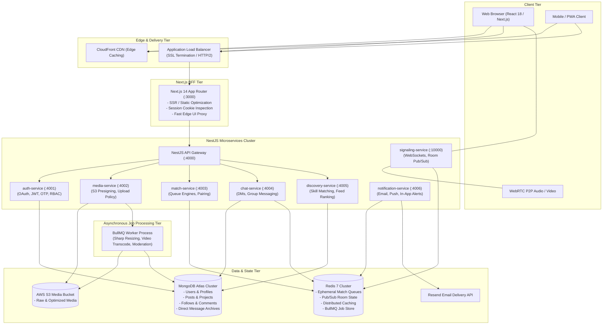

# DevConnect / NerdShive — Enterprise System Architecture Specification

> **Document Status**: Production Architecture Blueprint & Scaling Standard for 10M+ Monthly Active Users.

---

## 1. High-Level Architectural Overview

NerdShive / DevConnect employs a **hybrid Edge BFF + Asynchronous Event-Driven NestJS Microservices Architecture**. This design decouples client-facing server-side rendering (SSR) from backend compute, storage pipelines, and distributed real-time signaling.

---

## 2. Microservice Boundaries & Responsibilities

| Microservice | Protocol / Transport | Core Responsibilities | Data Store | Scaling Strategy |
| :--- | :--- | :--- | :--- | :--- |
| **`gateway`** | REST / gRPC | Request routing, JWT validation, global rate limiting, API documentation (Swagger/OpenAPI). | Redis (Rate limits) | Stateless horizontal autoscale (CPU > 70%) |
| **`auth-service`** | REST / Event Bus | Credentials authentication, OAuth token exchange (Google/GitHub), cryptographic OTP generation, password hashing (bcrypt), session tokens. | MongoDB (`users`, `accounts`, `verificationtokens`) | Stateless horizontal autoscale |
| **`media-service`** | REST / BullMQ | Direct-to-S3 pre-signed upload URL generation, MIME validation, post-upload processing trigger, CloudFront CDN formatting. | AWS S3 + Redis (BullMQ queue) | I/O-bound scaling |
| **`match-service`** | REST / Redis Streams | Intent-based matchmaking (`hiring`, `looking_for_job`, `project_teammate`), candidate deduplication, partner pairing algorithm. | Redis 7 (Sorted Sets & Hashes) | Memory-optimized autoscale |
| **`signaling-service`** | WebSockets (Socket.IO) | Stateless WebRTC signaling, ICE candidate exchange, room join/leave broadcasts, partner handshakes. | Redis (`@socket.io/redis-adapter`) | Connection-count autoscale |
| **`chat-service`** | WebSockets / REST | 1-on-1 direct messaging, mutual-follow verification, persistent message history archive. | MongoDB (`messages`, `chatrooms`) + Redis PubSub | Horizontal autoscale |
| **`discovery-service`** | REST | Skill-complement teammate discovery (gap-fill matching algorithm), feed ranking, search query indexing. | MongoDB (Read Replicas) + Redis (Cache) | Read-heavy caching layer |
| **`notification-service`** | Event Bus Consumer | Event-driven background processor for collaboration requests, follow alerts, and email notifications. | Redis Streams + Resend API | Worker pool autoscale |

---

## 3. Communication Patterns

### 3.1 Synchronous (RPC & REST)
- **Edge to BFF**: Next.js Server Components and Server Actions communicate with the Gateway via secure internal REST endpoints (`http://gateway:4000`).
- **Gateway to Services**: Internal HTTP/REST with JSON schemas and header propagation (`x-user-id`, `x-request-id`, `x-correlation-id`).

### 3.2 Asynchronous (Event-Driven Pub/Sub & Queues)
- **Cross-Service Domain Events**: Published to Redis Pub/Sub / Streams using the strongly typed `DomainEvent` envelope (`services/shared/events.ts`).
- **Heavy Media Processing**: Dispatched into BullMQ queue (`media-processing-queue`) with automatic exponential backoff retry policies (3 attempts) and dead-letter queues.

---

## 4. Containerization & Production Topology

The platform is fully containerized using Docker and Docker Compose:
- **`web`**: Next.js App Router container running Node.js in standalone output mode.
- **`services`**: NestJS microservices container executing the unified modular gateway and service workers.
- **`redis`**: Redis 7 Alpine with persistent AOF (Append Only File) storage for reliable queue state.
- **`mongodb`**: MongoDB 7 container for local development; managed MongoDB Atlas in production.

---

## 5. Reliability & Security Standards

1. **Zero Server Memory Buffering for Media**: All uploads use pre-signed PUT URLs. The Node.js application server never touches binary file streams.
2. **Stateless WebRTC Signaling**: Room membership and candidate handshakes use the Redis adapter, allowing signaling servers to restart or autoscale without dropping live video calls.
3. **Defense-in-Depth Authentication**: NextAuth session tokens at the BFF edge, verified JWTs internally, and cryptographically secure OTP tokens (`crypto.randomInt`).
4. **Resilience & Rate Limiting**: Distributed token-bucket rate limits on write endpoints returning explicit `429 Too Many Requests`.

---

## 6. Single Source of Truth (SSOT) & Operational Documentation

For complete architectural specifications, rollout runbooks, and domain invariants, refer to:
- [CORE_BUSINESS_LOGIC_SSOT.md](./CORE_BUSINESS_LOGIC_SSOT.md): The authoritative single source of truth for platform domain logic, invariants, and extension rules.
- [INFRASTRUCTURE_ROLLOUT_AND_SCALING_BIBLE.md](./INFRASTRUCTURE_ROLLOUT_AND_SCALING_BIBLE.md): Production rollout guide, edge CDN configuration, Oracle Always Free setup, and 0-to-10M scaling blueprint.
- [DATA_STORAGE_AND_BACKUP_POLICY.md](./DATA_STORAGE_AND_BACKUP_POLICY.md): Data storage classification, zero-loss backup architecture, 180-day statutory retention, and IT Act compliance.
- [SCHEMA_EVOLUTION_AND_COMPATIBILITY_RULES.md](./SCHEMA_EVOLUTION_AND_COMPATIBILITY_RULES.md): Non-negotiable engineering standard for entity evolution, backward compatibility, and collision prevention.

